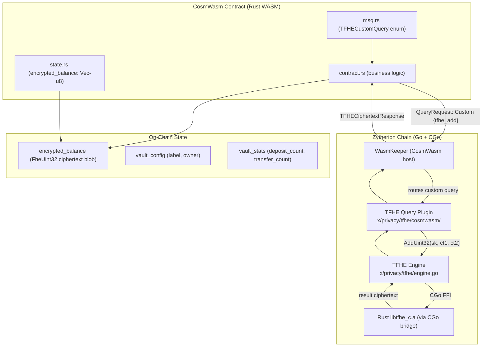
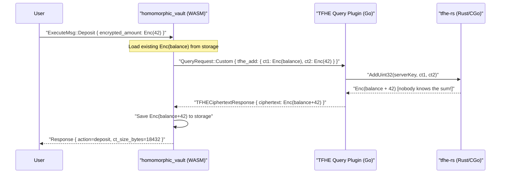

# Homomorphic Smart Contracts on Zytherion

> **Privacy-preserving computation where encrypted values are manipulated without ever being decrypted.**

## Table of Contents

1. [What Is Fully Homomorphic Encryption?](#what-is-fully-homomorphic-encryption)
2. [Architecture](#architecture)
3. [TFHE × CosmWasm Binding](#tfhe--cosmwasm-binding)
4. [Supported Operations](#supported-operations)
5. [Contract Developer Guide](#contract-developer-guide)
6. [Building & Deploying](#building--deploying)
7. [Security Model](#security-model)
8. [Key Management](#key-management)
9. [Future Work](#future-work)

---

## What Is Fully Homomorphic Encryption?

**Fully Homomorphic Encryption (FHE)** allows computation on encrypted data without decrypting it first.

Given:
- `Enc(a)` = ciphertext of value `a`
- `Enc(b)` = ciphertext of value `b`

You can compute:
- `Enc(a + b)` = `Enc(a) HOM+ Enc(b)` without knowing `a` or `b`

When later decrypted: `Dec(Enc(a + b)) = a + b`

### Why FHE on a Blockchain?

| Problem | Traditional Blockchain | FHE Blockchain |
|---------|----------------------|----------------|
| Transfer amounts | Visible to all validators | Encrypted — validators see only ciphertexts |
| Balance accumulation | Plaintext addition | Homomorphic addition on ciphertexts |
| Computation privacy | Not possible | Arbitrary ops on private data |
| Decentralized privacy | Requires trusted setup / ZK circuits | Cryptographic, no trusted setup needed |

Zytherion uses **TFHE (Fast Fully Homomorphic Encryption over the Torus)** from [Zama's tfhe-rs](https://github.com/zama-ai/tfhe-rs) library via a CGo bridge — the fastest available FHE scheme for integer arithmetic.

---

## Architecture



### Data Flow: Deposit Operation



---

## TFHE x CosmWasm Binding

### How It Works

1. **Plugin Registration** — At chain startup, `app/app.go` creates a `NewTFHEQueryPlugin()` and registers it as the `Custom` query handler in the CosmWasm keeper via `wasmkeeper.WithQueryPlugins`.

2. **Contract Query** — A CosmWasm contract sends a `QueryRequest::Custom` containing a JSON-encoded `TFHECustomQuery` struct.

3. **Dispatch** — The plugin deserializes the query, dispatches to the appropriate handler (`handleEncrypt`, `handleAdd`, etc.).

4. **Key Management** — The plugin lazily loads (or generates) the node's TFHE `ClientKey` / `ServerKey` on first use, cached in memory for the process lifetime.

5. **Result** — The handler calls into the Go TFHE engine (via CGo into Rust `libtfhe_c.a`) and returns a JSON-encoded response.

### Build Tags

| Tag | File Compiled | Behaviour |
|-----|--------------|-----------|
| *(none)* | `query_plugin.go` | All queries return `ErrTFHEDisabled` — node starts cleanly |
| `tfhe_cgo` | `query_plugin_cgo.go` | Real homomorphic operations via Rust |

```bash
# Stub build (default, always works):
go build ./...

# Full TFHE build (requires libtfhe_c.a):
go build -tags tfhe_cgo ./...
```

---

## Supported Operations

| JSON Query Key | Input | Output | Description |
|----------------|-------|--------|-------------|
| `tfhe_encrypt` | `{ value: u32 }` | `TFHECiphertextResponse` | Encrypt a uint32 with the node's ClientKey |
| `tfhe_decrypt` | `{ ciphertext: Binary }` | `TFHEPlaintextResponse` | Decrypt a ciphertext (**testing only!**) |
| `tfhe_add` | `{ ct1: Binary, ct2: Binary }` | `TFHECiphertextResponse` | Homomorphic addition of two FheUint32 |
| `tfhe_mul_scalar` | `{ ciphertext: Binary, scalar: u32 }` | `TFHECiphertextResponse` | Multiply encrypted value by plaintext scalar |
| `tfhe_verify` | `{ ciphertext: Binary }` | `TFHEVerifyResponse` | Check if ciphertext is structurally valid |

### Query JSON Format

```json
// Encrypt
{ "tfhe_encrypt": { "value": 42 } }

// Add two ciphertexts
{ "tfhe_add": { "ct1": "<base64>", "ct2": "<base64>" } }

// Multiply by scalar
{ "tfhe_mul_scalar": { "ciphertext": "<base64>", "scalar": 3 } }

// Decrypt (demo only)
{ "tfhe_decrypt": { "ciphertext": "<base64>" } }

// Verify
{ "tfhe_verify": { "ciphertext": "<base64>" } }
```

---

## Contract Developer Guide

### Setting Up TFHE Custom Queries in Your Contract

**Step 1 — Define the query enum** in `msg.rs`:

```rust
use cosmwasm_std::Binary;
use schemars::JsonSchema;
use serde::{Deserialize, Serialize};

/// Must match the JSON keys the Go plugin expects
#[derive(Serialize, Deserialize, Clone, Debug, PartialEq, JsonSchema)]
#[serde(rename_all = "snake_case")]
pub enum TFHECustomQuery {
    TfheEncrypt { value: u32 },
    TfheAdd { ct1: Binary, ct2: Binary },
    TfheMulScalar { ciphertext: Binary, scalar: u32 },
    TfheDecrypt { ciphertext: Binary },
    TfheVerify  { ciphertext: Binary },
}

#[derive(Serialize, Deserialize, Clone, Debug, PartialEq, JsonSchema)]
pub struct TFHECiphertextResponse {
    pub ciphertext: Binary,
    pub size_bytes: u64,
}
```

**Step 2 — Call the TFHE plugin** from `contract.rs`:

```rust
use cosmwasm_std::{from_binary, to_binary, Deps, QueryRequest, StdResult};
use crate::msg::{TFHECiphertextResponse, TFHECustomQuery};

fn add_ciphertexts(
    deps: Deps,
    ct1: Binary,
    ct2: Binary,
) -> StdResult<TFHECiphertextResponse> {
    let query = TFHECustomQuery::TfheAdd { ct1, ct2 };
    let request: QueryRequest<TFHECustomQuery> = QueryRequest::Custom(query);

    let raw = to_binary(&request)?;
    let result_raw = deps.querier.raw_query(&raw).unwrap()?;
    let result: TFHECiphertextResponse = from_binary(&result_raw)?;

    // result.ciphertext is Enc(a + b) — no party knows the sum!
    Ok(result)
}
```

**Step 3 — Accumulate an encrypted balance**:

```rust
use cw_storage_plus::Item;

const BALANCE: Item<Vec<u8>> = Item::new("balance");

pub fn deposit(deps: DepsMut, new_ct: Vec<u8>) -> Result<Response, ContractError> {
    let updated = match BALANCE.may_load(deps.storage)? {
        Some(existing) => {
            add_ciphertexts(
                deps.as_ref(),
                Binary::from(existing),
                Binary::from(new_ct),
            )?.ciphertext.to_vec()
        }
        None => new_ct,
    };
    BALANCE.save(deps.storage, &updated)?;
    Ok(Response::new().add_attribute("action", "deposit"))
}
```

### Important Notes for Contract Developers

**Ciphertext size**: FheUint32 ciphertexts are approximately 16-21 KB each. Store them as `Vec<u8>` (Item) or map values.

**`tfhe_decrypt` reveals the plaintext on-chain!** The decryption result appears in the query response. Only use it for testing. In production, decrypt off-chain using the ClientKey.

**Arithmetic wraps at 2^32** — FheUint32 operations wrap mod 2^32. Design your contract logic accordingly.

**Performance**: Each homomorphic operation takes milliseconds in the Go/Rust layer. Ciphertext transmission over RPC can add latency for large ciphertexts.

---

## Building & Deploying

### Prerequisites

```bash
# Rust with wasm target
rustup target add wasm32-unknown-unknown

# Build the Rust TFHE C library first
cd x/privacy/tfhe/tfhe_c && cargo build --release

# Build the full node with TFHE CGo support
go build -tags tfhe_cgo -o zytheriond ./cmd/zytheriond
```

### Build the Contract

```bash
cd contracts/homomorphic_vault
cargo build --release --target wasm32-unknown-unknown
# Output: target/wasm32-unknown-unknown/release/homomorphic_vault.wasm
```

### Deploy via Script

```bash
bash scripts/deploy_homomorphic_vault.sh
```

### Manual Deployment

```bash
# 1. Upload
zytheriond tx wasm store \
  contracts/homomorphic_vault/target/wasm32-unknown-unknown/release/homomorphic_vault.wasm \
  --from alice --keyring-backend test --chain-id zytherion --fees 50000zytc --yes

# 2. Get Code ID
CODE_ID=$(zytheriond query wasm list-code --output json \
  | python3 -c "import sys,json; print(json.load(sys.stdin)['code_infos'][-1]['code_id'])")

# 3. Instantiate
zytheriond tx wasm instantiate $CODE_ID \
  '{"label":"My Vault","owner":"zyth1..."}' \
  --from alice --label "homomorphic-vault-v1" \
  --keyring-backend test --chain-id zytherion --fees 50000zytc --yes

# 4. Get contract address
CONTRACT=$(zytheriond query wasm list-contract-by-code $CODE_ID --output json \
  | python3 -c "import sys,json; print(json.load(sys.stdin)['contracts'][0])")

# 5. Query info
zytheriond query wasm contract-state smart $CONTRACT '{"vault_info":{}}'

# 6. Query encrypted balance
zytheriond query wasm contract-state smart $CONTRACT '{"encrypted_balance":{}}'
```

---

## Security Model

### What Each Party Knows

| Party | Can Encrypt | Can Decrypt | Can Evaluate | Sees Ciphertexts |
|-------|-------------|-------------|--------------|------------------|
| User (holds ClientKey) | Yes | Yes | No | Yes |
| Validator (holds ServerKey) | No | **No** | Yes | Yes |
| General public | No | No | No | Yes |

### Threat Analysis

| Threat | Mitigation | Status |
|--------|-----------|--------|
| Validator learns balance | Validators hold ServerKey only — cannot decrypt | Protected |
| Node operator learns balance | ClientKey never leaves the user | Protected (future: user-held keys) |
| Adversary brute-forces ciphertext | TFHE security >= 128-bit | Protected |
| Malicious validator submits wrong result | Deterministic evaluation; clients can verify | Partial |
| ClientKey leaked | All vaults encrypted with that key are compromised | User responsibility |
| Key rotation | Currently unsupported | Planned |

### What Is NOT Private

- **Transaction graph**: who deposited to which contract is visible
- **Ciphertext sizes**: reveal the data type (FheUint32 approximately 16-21 KB)
- **Number of deposits**: `deposit_count` is stored as plaintext
- **Memo fields**: stored as plaintext event attributes

---

## Key Management

### Node Keys (Managed by the Plugin)

The TFHE plugin manages two keys per node, persisted in the home directory:

| File | Purpose | Sensitivity |
|------|---------|-------------|
| `~/.zytherion_tfhe_client.key` | Encrypt and Decrypt | **SECRET** — guard like a private key |
| `~/.zytherion_tfhe_server.key` | Homomorphic evaluation (add, mul) | Can be shared |

Keys are generated automatically on first use (this can take 10-60 seconds). Subsequent node restarts load from disk automatically.

### User Keys (Future: Client-Side)

For a production trustless system, users would maintain their own ClientKey to encrypt values before submitting them to the chain. The current implementation uses the **node's** ClientKey — meaning the node operator can decrypt balances. This is suitable for permissioned chains or demonstrations.

---

## Future Work

| Feature | Description | Priority |
|---------|-------------|----------|
| User-managed keys | Each user brings their own ClientKey; node has only ServerKey | High |
| FHE Subtraction | Dedicated subtract operation for withdrawal/transfer | High |
| FheUint64 support | Larger integer range for token amounts | Medium |
| Comparison operations | `gt`, `lt`, `eq` for private conditional logic | Medium |
| Multi-key FHE | Multiple parties' ciphertexts interoperable | Medium |
| Key rotation | Graceful re-encryption of stored balances | Medium |
| Off-chain decrypt CLI | `zytheriond fhe decrypt --key-file ck.key --ct <base64>` | High |
| Cross-contract transfers | Transfer encrypted amounts between vault contracts | Medium |
| ZK proof of evaluation | Prove FHE was evaluated correctly without re-running | Low |

---

*Zytherion — Building Privacy-First Blockchain Infrastructure*

*TFHE implementation powered by [Zama's tfhe-rs](https://github.com/zama-ai/tfhe-rs) (Apache 2.0 License)*
